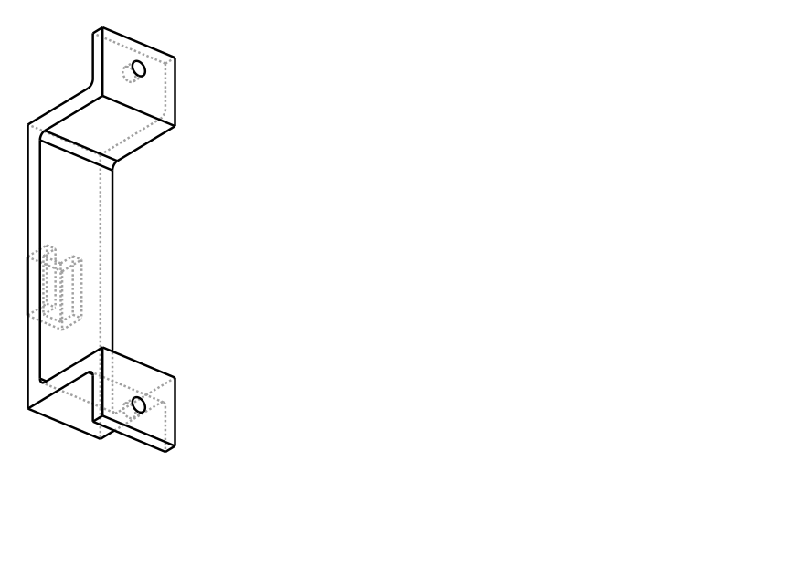

# Adapter U-Bracket

Two of these hold a power adapter under a bench. The adapter sits in the U, the
bench underside closes the top, and each bracket screws up through its two
flanges.

**Print whichever width you need, twice.**

Files are named **width × depth** — the adapter's own cross-section, not the
opening. Depth is no longer the same on every size, and a file called just
`76mm` sitting next to `66mm` is exactly how the wrong one gets printed.

| File | Adapter | Opening | Bracket | Screw spacing |
| --- | --- | --- | --- | --- |
| `stl/u-bracket-52x33.stl` | 52.00 × 33.25 | 53.00 × 33.75 | 95.00 W × 38.75 H | 79.00 mm |
| `stl/u-bracket-56x33.stl` | 56.00 × 33.25 | 57.00 × 33.75 | 99.00 W × 38.75 H | 83.00 mm |
| `stl/u-bracket-66x33.stl` | 66.00 × 33.25 | 67.00 × 33.75 | 109.00 W × 38.75 H | 93.00 mm |
| `stl/u-bracket-76x25.stl` | 76.20 × 25.40 | 77.20 × 25.90 | 119.20 W × 30.90 H | 103.20 mm |



Everything else is shared between the two:

| | |
| --- | --- |
| Band (depth along the adapter) | 25 mm |
| Wall / floor | 5 mm |
| Flanges | 16 × 4 mm, 1 screw each |
| Cable-tie loop | hangs 8 mm below, 6 × 5 mm opening, 18 mm tunnel |
| Hangs below the bench | 46.75 mm |
| Each bracket | ~17 g, ~30 min |

**On the 76.2 × 25.4 (3" × 1"):** I read "deep" as the adapter's other
cross-section dimension — how deep it sits in the U — matching how the earlier
sizes were given as width × thickness. So that one's U is 25.9 mm deep instead
of 33.75, and the bracket only hangs 38.90 mm below the bench. If you actually
meant the **band** (how far the strap wraps along the adapter, currently 25.0 mm
on every size), say so — that's `BAND_W`, one line, and the U goes back to
33.25.

At 76.2 mm the floor spans 77.2 mm unsupported between the legs. Still fine:
5 mm thick × 25 mm wide, it deflects about 0.06 mm under a half-pound adapter,
so there's no need to thicken anything.

Adding another size is one line: put `(width, depth)` in `SIZES` at the top of
`src/u_bracket.py` and re-run. Every size comes out of a single run, so the
files you've already printed cannot drift while you're editing for a new one.

## Clearance — read this before printing

Each opening is **0.5 mm per side wider** than the size given, because those
are the adapter's own measurements. A 52.00 mm opening will not accept a
52.00 mm adapter.

If a number was already the opening you wanted rather than the brick itself,
set `CLR_W` and `CLR_H` to 0 in `src/u_bracket.py` and re-run.

## Cable-tie loop

A closed loop hangs **8 mm below the floor** of the U, with a 6 × 5 mm opening
and an 18 mm tunnel running across the bracket.

It hangs below rather than passing through the floor because slots in the
floor would have to be threaded blind — from underneath, with the adapter
already in the U and the bracket already screwed to the bench. The loop is
reachable with everything installed.

It also keeps the floor of the U completely flat. A tie crossing the inside
would sit proud of the seating surface and rock the adapter, and the opening
only carries 0.5 mm of clearance to absorb that.

The tunnel runs **across** the bracket so a tie threaded through it wraps
naturally around a cable running lengthwise underneath.

Walls are 5 mm and the band 25 mm — the floor is what the loop hangs off, so
it carries the cable tension.

## Material: PETG

A 90 W adapter under load runs 50–60 °C on its case, which is right at PLA's
softening point. The bracket is in direct contact with it and sits in dead air
under a bench. Use PETG here. This is the one part in this repo where PLA is
the wrong answer.

The U is open at both ends and along its whole length between the two
brackets, so the adapter can still shed heat.

## Printing

Lay flat as exported — the cross-section sits on the bed, so every face is a
vertical wall. **No supports.** 0.2 mm layers, 4 walls, 20 % infill.

## Fitting

1. Position the two brackets along the adapter — roughly 1/4 and 3/4 of its
   length, clear of both cable exits.
2. Hold them to the bench underside, mark the four holes, drill 3 mm pilots.
3. **Check screw length against the bench top thickness** before driving. #8
   pan head, long enough to bite but not to punch through the work surface.
4. If the adapter is a loose rattle, a strip of adhesive foam on the inside of
   the U takes up the slack.

## Rebuilding

```sh
pip install cadquery
python3 src/u_bracket.py
```
