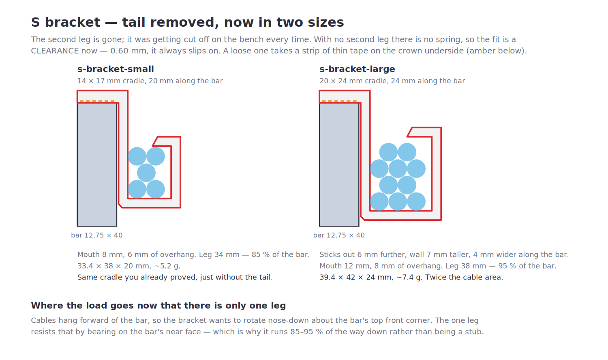

# Cable Hooks — TBK 801 bench

Open hooks: no cutting and re-fitting zip ties. Cables go in, cables come out.

| File | Mount | Size | Each |
| --- | --- | --- | --- |
| `stl/s-bracket-small.stl` | hooks over a 12.75 × 40 mm cross bar | 33.4 × 38 × 20 mm | ~5.2 g |
| `stl/s-bracket-large.stl` | same, bigger cradle | 39.4 × 42 × 24 mm | ~7.4 g |
| `stl/cable-hook-screw.stl` | 1 × #8 screw into the bench underside | 36 × 23 × 20 mm | ~4.8 g |



## The tail is gone

The bracket used to have a second leg down the far face of the bar, sprung to
pinch it. It got **cut off on the bench every time**, so it isn't in the model
any more.

That changes the fit in a way worth being explicit about: with no second leg
there is **no spring left**, so the gap can no longer be an interference. A gap
under 12.75 mm would simply refuse to go on. It's now a **0.60 mm clearance** —
it always slips over the bar.

For a loose one, put a strip of thin double-sided tape or adhesive foam on the
**crown's underside**. That's the bearing face, so tape there does two jobs: it
fills the slop, and it puts back the friction the second leg used to provide.
It also doesn't care how thick the bar actually turns out to be, which the old
sprung gap very much did.

An assert now fails the build if that gap is ever set under the bar thickness
again.

### Where the load goes with one leg

Cables hang forward of the bar, so the bracket wants to rotate nose-down about
the bar's top front corner. The single leg resists that by bearing on the bar's
near face — which is why it runs **85–95 % of the way down** a 40 mm bar rather
than being a stub. There's an assert on that ratio too.

## Two sizes

Only the cradle differs. Everything above it — crown, leg gap, leg thickness —
is shared.

| | small | **large** |
| --- | --- | --- |
| Cradle | 14 × 17 mm | **20 × 24 mm** |
| Along the bar | 20 mm | **24 mm** |
| Mouth | 8 mm | **12 mm** |
| Lip overhang | 6 mm | **8 mm** |
| Leg | 34 mm (85 %) | **38 mm (95 %)** |
| Cable area | 238 mm² | **480 mm²** |

The large sticks out **6 mm further**, the wall runs **7 mm taller**, and I also
took it **4 mm wider along the bar** — that's the cheapest capacity you can buy
and it widens the bearing on the bar at the same time, which matters more now
that the tail is gone. Say the word if you'd rather it stayed at 20 mm.

`SIZES` at the top of `src/cable_hook.py` holds both; another size is one line.

## The cradle is not an open bucket

The outer wall runs up **past** the cables and returns inward over them. Mouth
8 mm into a 14 mm cradle (12 into 20 on the large) — the same proportions as the
screw hook, which is the shape that already works. Push a cable past the lip and
the only way back out is to lift it out on purpose. An assert fails the build if
the mouth ever stops being narrower than the cradle.

Upper hook opens **down** over the bar, lower hook opens **up** for the cables.
That's still the S, and both halves work with gravity: the bar's top face holds
the bracket up, the lip holds the cables in.

One closed profile from the crown to the lip — no join anywhere for a load to
pull open. The crown/leg corner is deliberately left **sharp**: a fillet there is
concave, so it fills material into the exact corner the bar's top front edge
occupies. A 1.5 mm radius ate the clearance down to 0.05 mm and would have
stopped the crown seating flat.

## The screw version

Side-opening throat, 14 × 16 mm, with an 8 mm mouth — narrower than the throat,
so cables push in and stay. One #8 screw through the middle of the foot. Drops
23 mm below the bench.

## Printing

All three are a single constant cross-section, so they print **on their side
with every face a vertical wall — no supports**.

**Use a brim.** The first layer is a handful of narrow strips.

0.2 mm layers, **4 walls**. PLA+ is fine now — with the sprung leg gone there is
no spring feature left in the part, so nothing is being asked to flex.

## Fitting

Hook it over the bar and slide it along to position. If it rocks, tape on the
crown underside.

## Rebuilding

```sh
pip install cadquery
python3 src/cable_hook.py
```
