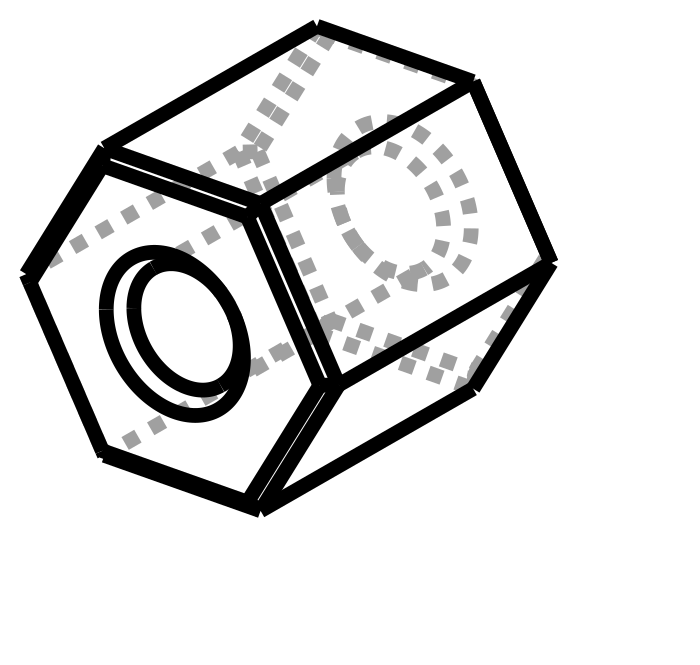

# 15 mm Hex Spacer — nut-style standoff

For mounting the mini-PC bracket on the back of the workstations. One goes on
the screw between the bracket and the surface and holds the bracket 15 mm proud.



| | |
| --- | --- |
| Thickness | **15.0 mm** (1.5 cm) |
| Across flats | 14.0 mm — 14 mm wrench, or fingers |
| Across corners | 16.2 mm |
| Each | ~2.5 g, ~6 min |

## Which one to print

I don't have your fastener size, so all three are exported. Grab the one that
matches the screw and print as many as the bracket has mounting points.

| File | Bore | Fits | Wall |
| --- | --- | --- | --- |
| `stl/hex-spacer-15mm-m4.stl` | 4.5 mm | M4 | 4.8 mm |
| `stl/hex-spacer-15mm-m5.stl` | 5.5 mm | M5, #8, #10 | 4.2 mm |
| `stl/hex-spacer-15mm-m6.stl` | 6.8 mm | M6, ¼", #12 | 3.6 mm |

If none of those is right, `BORES` at the top of `src/hex_spacer.py` is a
one-line change.

It's a **spacer, not a nut** — the bore is clearance, not thread. The screw does
the clamping; this only holds the distance. The hex is so you can grip it while
the screw is driven, and so it doesn't roll off the bench.

Both ends of the bore are chamfered 0.8 mm so the screw finds the hole without
fishing for it, and the hex ends carry a 0.5 mm chamfer so they sit flat.

## Printing

Axis up, as exported — a 15 mm hex prism with a vertical hole. No supports, and
it puts the layers **across** the load, which is the strong direction for a part
in pure compression.

0.2 mm layers, 4 walls (it comes out essentially solid at that wall count),
brim if you're printing a lot of them at once.

PLA+ is fine. This part only ever gets squeezed, and PLA is stiff and
dimensionally accurate in compression — no reason to reach for PETG.

## Rebuilding

```sh
pip install cadquery
python3 src/hex_spacer.py
```
