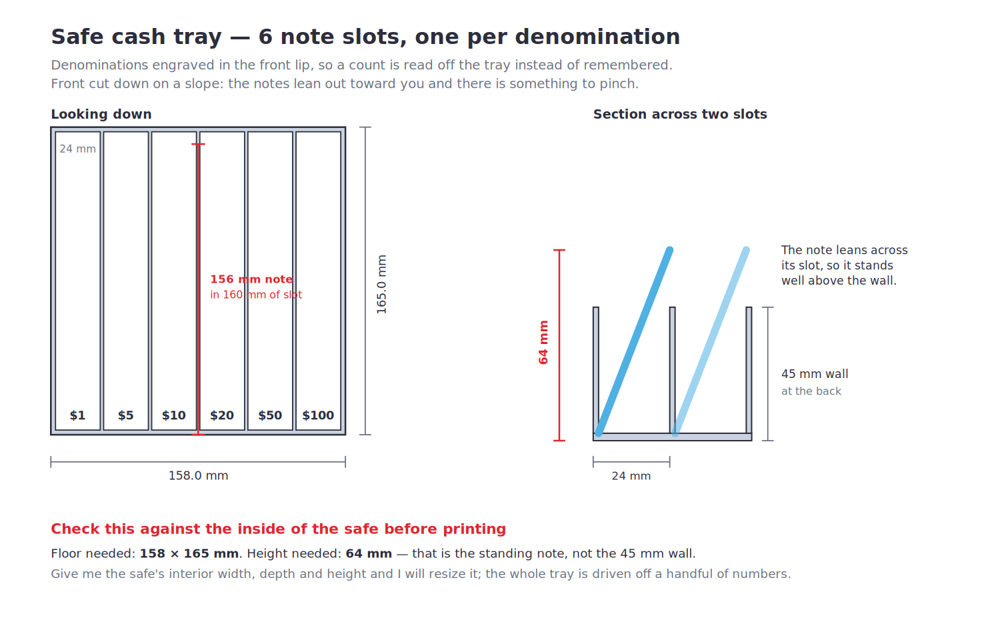

# Safe Cash Tray

Same idea as the acrylic trays on Amazon — notes stood on edge, leaning back so
every denomination is visible at once — with three changes that matter for us.



| | |
| --- | --- |
| File | `stl/safe-cash-tray.stl` |
| Footprint | **158.0 × 165.0 mm** |
| Height | 20 mm front lip rising to 45 mm at the back |
| Slots | 6 × 24 mm, one per denomination |
| Labels | `$1 $5 $10 $20 $50 $100`, engraved 0.6 mm |
| Material | ~166 cm³, so roughly 190–210 g |

## Check the safe first

**Floor needed: 158 × 165 mm. Height needed: 64 mm.**

That 64 mm is the *standing note*, not the 45 mm wall — a note leans across its
slot, and a US note is 66.3 mm on the short side, so it projects well above the
tray. Measure the inside of the safe against 64 mm, not 45.

I sized this to the print bed and to a real note, since I don't have your safe's
interior dimensions. **Give me interior width, depth and height and I'll resize
it** — the whole tray is derived from a handful of numbers at the top of
`src/cash_tray.py`, so it's a re-run, not a redesign.

## What's different from the Amazon one

**6 slots, not 8.** US notes all share one size, so six covers every
denomination and there is nothing left over to fill. No coin slots — coin rolls
are not kept in the safe. That drops the tray from 218 mm wide to 158 mm and
takes a quarter off the print.

If coins ever do need a home, `N_COIN = 2` at the top of the source puts two
28 mm slots back (a quarter roll is 25 mm across, and a 160 mm slot holds two
end to end). Nothing else needs touching.

**Denominations engraved in the front lip.** A count gets read off the tray
instead of remembered, which is the whole point when the number ends up in a
cash audit.

**Sized to a note, not to a box.** 160 mm of slot length for a 156 mm note.

## How it's built

The front is cut down on a **slope** — 20 mm at the lip rising to 45 mm over the
front 95 mm. That leans the notes out toward you and gives you something to
pinch. It's an upward-facing surface, so it costs nothing in print time.

A **scallop in each end wall** gives you somewhere to get your fingers to lift
the tray out of the safe. The tray's stiffness under that lift comes from the
front and back walls, not the floor — a full tray of cash deflects well under a
tenth of a millimetre across the span.

## Printing

Prints as exported: **flat on the floor, walls up. No supports, no brim** — the
first layer is a solid 158 × 165 mm rectangle, so adhesion is not going to be
the problem.

0.2 mm layers, 4 walls, 15 % infill (it's nearly all perimeter anyway). PLA+ is
right: it lives in a safe, never gets warm, and stiffness is what you want.

**It's still a long print** at ~166 cm³ — slice it and look at the real number
before you commit. The acrylic one is $20 and arrives in two days, so the case
for printing rests entirely on the two things it can't do: fitting *your* safe
exactly, and carrying the denomination labels.

## Rebuilding

```sh
pip install cadquery
python3 src/cash_tray.py
```

Slot count, widths and labels are all constants at the top of the file.
