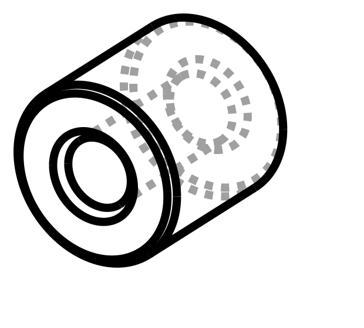

# 15 mm Washer Spacer — #10

For mounting the mini-PC bracket on the back of the workstations. One goes on
the screw between the bracket and the surface and holds the bracket 15 mm proud.

A plain round barrel — a very thick washer.



| | |
| --- | --- |
| File | `stl/spacer-15mm-10.stl` |
| Thickness | **15.0 mm** (1.5 cm) |
| Outside | 14.0 mm |
| Bore | **5.5 mm — #10 free fit** |
| Wall | 4.25 mm |
| Each | ~2.4 g, ~6 min |

## The numbers

**Bore 5.5 mm for a #10.** A #10 shank is 4.83 mm, and a close-fit clearance
drill would be 5.0. I've gone free-fit instead because printed holes come out a
little under nominal — 5.5 modelled lands around 5.2–5.4 in PLA, which still
clears a #10 without the spacer rattling on the screw. If yours comes out tight,
open it with a 7/32" bit rather than reprinting.

**Outside 14.0 mm.** A standard #10 washer is 12.7 mm; the extra 1.3 mm is wall,
which takes it from 3.6 mm to 4.25 mm. If you need it to match a washer footprint
exactly — say it has to drop into a recess — `OD` is one line.

Both ends of the bore are chamfered 0.8 mm so the screw finds the hole without
fishing, and the outside ends carry a 0.5 mm chamfer so it seats flat.

It's a **spacer, not a nut** — the bore is clearance, not thread. The screw does
the clamping; this only holds the distance. Being round it spins freely on the
screw, so unlike the hex version there's nothing to hold while you drive it.

## Printing

Axis up, as exported — a barrel with a vertical hole. No supports, and it puts
the layers **across** the load, which is the strong direction for a part in pure
compression.

0.2 mm layers, 4 walls (it comes out essentially solid at that wall count),
brim if you're printing a batch.

PLA+ is fine. This part only ever gets squeezed, and PLA is stiff and
dimensionally accurate in compression — no reason to reach for PETG.

## Rebuilding

```sh
pip install cadquery
python3 src/spacer.py
```

Another size is one line in `SIZES`.
