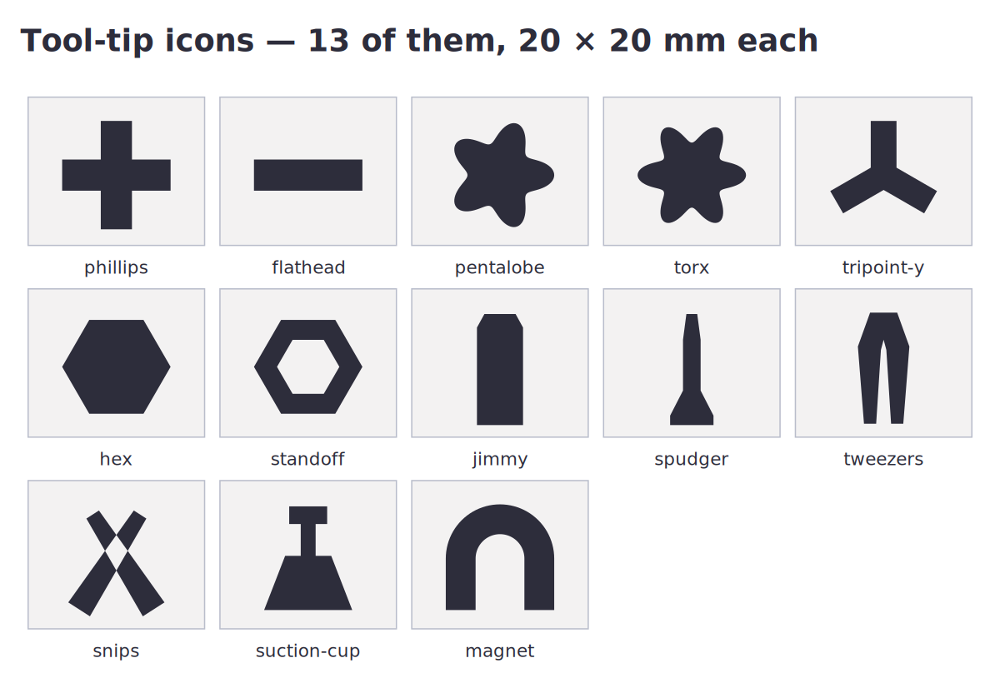

# Tool-Tip Icons

Thirteen icons for labelling the tool organizer, built to import into TinkerCAD
without a fight.



| Driver tips | Tools |
| --- | --- |
| `phillips` `flathead` `pentalobe` `torx` `tripoint-y` `hex` `standoff` | `jimmy` `spudger` `tweezers` `snips` `suction-cup` `magnet` |

Each is a **20 × 20 mm** SVG in `svg/`. (`_contact-sheet.svg` is just the
picture above — don't import that one.)

## Why these will import when most SVGs don't

TinkerCAD's importer has three rules that quietly ruin most icon files:

- **It reads fills only.** A stroked outline with no fill imports as *nothing*.
  Every path here is a solid fill with no stroke attribute anywhere.
- **It ignores `<text>`.** Nothing here is a text element.
- **Plain polygons survive best.** Every curve — the Torx and Pentalobe lobes,
  the horseshoe — is polygonised at build time, so there are no arcs or béziers
  to be interpreted differently.

The `standoff` hex has a real hole in it. That's done by winding the inner ring
the *opposite* direction rather than relying on `fill-rule="evenodd"`, which
importers disagree about.

The build asserts all three — it fails if a stroke or a text element ever creeps
in, or if a point lands outside the 20 mm box.

## Importing into TinkerCAD

1. **Import → the SVG**, and set the size in the dialog.
2. It arrives as a solid. Drag the top handle down to about **1 mm** tall.
3. With it selected, switch it from Solid to **Hole**.
4. Drop it onto the organizer's face so it sinks in about **0.6 mm**.
5. Select both → **Group**. Engraved.

**Engrave, don't emboss.** On a tool tray a raised icon gets abraded by tools
going in and out, and a thin raised feature can peel off the surface. A recess
can't. 0.6 mm deep is three layers at 0.2 mm — plenty of contrast, no
structural cost.

## How small you can go

The thinnest feature in the set is **1.8 mm at 20 mm** (the tweezer tips). An
engraved groove needs roughly two nozzle widths — about **0.8 mm** with a 0.4 mm
nozzle — or it just doesn't appear.

That puts the floor at about **10 mm**. Somewhere in the **12–16 mm** range is
comfortable and still reads across a bench.

If you scale one below 10 mm, the fine parts of `tweezers`, `snips` and
`standoff` will start to disappear first. The geometric driver tips
(`phillips`, `flathead`, `hex`) hold up smallest.

## Adding one

Each icon is one function in `src/icons.py` returning a list of polygons. Tell
me what tool and I'll add it — or copy an existing function and change the
points.

```sh
python3 src/icons.py
```
