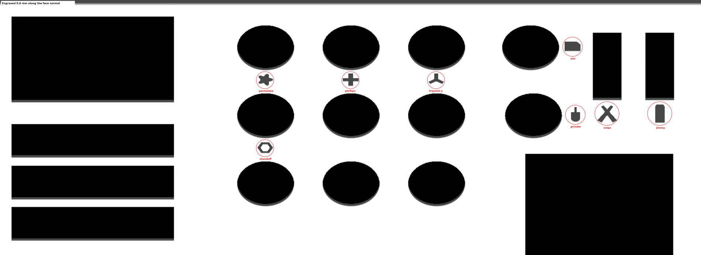
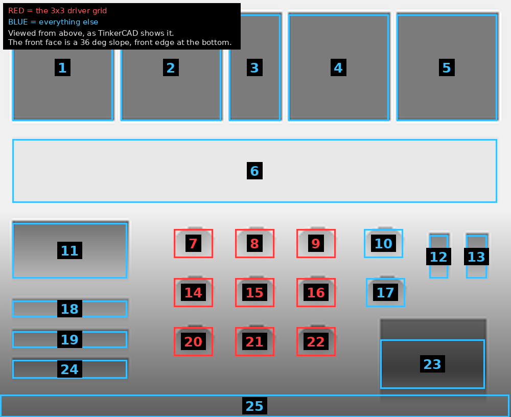

# CPR Tool Organizer — icons engraved

Takes your `CPR_Tool_Organizer_Master.stl` and cuts the tool-tip icons into it.

| | |
| --- | --- |
| Output | `stl/CPR_Tool_Organizer_Master-engraved.stl` |
| Depth | 0.6 mm, measured along the face normal |
| Icon sizes | 7 mm in the grid, 10 mm where there's room |
| Volume removed | 86.5 mm³ — matches the icon outlines exactly |



## The face is a slope, and that changes the job

The front of the organizer isn't flat and isn't horizontal. It's a plane at

```
z = 30.0 + 0.75 · y          (3-in-4, 36.87° from horizontal)
```

measured off your mesh and re-checked by the build every run. So the icons are
cut **along the face normal**, not straight down. A vertical cut would land as a
smeared ellipse and would be deeper at the bottom than the top.

## Two things the top view got wrong

**Pocket rims have a lead-in.** The opening you see from above starts about
1.5 mm before the flat face actually ends. Between the grid rows there is only
**8.0 mm** of real flat face, not the 10 mm a top-view survey implies. Sizes
here come from raycasting the mesh, and the build re-measures nine points
around every icon before cutting — it refuses to cut if any of them is more
than 0.05 mm off the plane.

**An icon centred in a gap belongs to neither hole.** With 8 mm of face between
two rows, a centred icon sits equidistant from both. Each one is hung from the
top of its band instead: 0.5 mm of face above, 1.9 mm below, so it's nearly
four times closer to the hole it labels.

That's also why the grid icons are 7 mm and the far-right ones are 10 mm — the
slots at 12 and 13 have 18.7 mm of clear face beneath them, so there's no
reason to shrink those.

## What I assumed

Numbers refer to the pocket map:



| Pocket | Icon | Placed |
| --- | --- | --- |
| 7, 8, 9 | pentalobe, phillips, tripoint-y | under, 7 mm |
| 14 | standoff | under, 7 mm |
| 10 | sim | **beside**, 8 mm |
| 17 | grinder | **beside**, 8 mm |
| 12 | snips | under, 10 mm |
| 13 | jimmy | under, 10 mm |

**10 and 17 get theirs alongside, not underneath.** There is only 8.0 mm of
face under 10 and **5.3 mm** under 17 — not enough for a legible icon — but
15.9 mm of clear column to their right. Each sits 0.8 mm off its own pocket and
3 mm or more off the next, so it still reads as belonging to the hole on its
left. The build refused the first attempt at this: pocket 17's rim runs 0.2 mm
further right than the row I had probed, and the band check caught it before
anything was cut.

**Five of the nine grid holes are unlabelled** (15, 16, 20, 21, 22) — four
icons were given for a nine-hole grid, so they went in the first four positions
in reading order. Pockets 11 and 23 are unlabelled too.

## Re-running

```sh
pip install trimesh manifold3d shapely scipy
python3 src/engrave.py
```

`PLACEMENTS` at the top of `src/engrave.py` is the whole mapping — icon name,
x, the clear band it sits in, size, and whether it hangs under the pocket or
centres in its band. Changing an assignment is one line.
