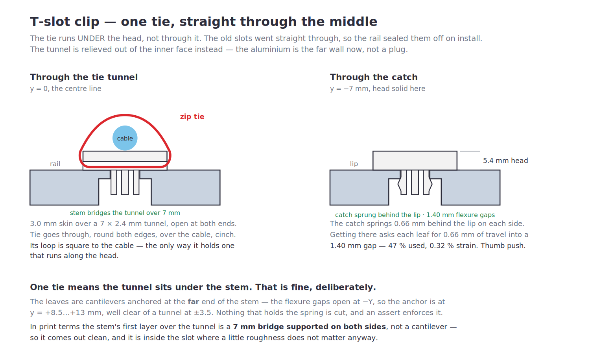

# T-Slot Cable Clip — TBK 801 bench

Snap-in cable anchor for the bench frame's aluminium T-slot. Pushes in anywhere
along the slot: no access to an open end, no disassembly.



| | |
| --- | --- |
| Slot it fits | 8.49 mm opening, 10 mm deep, cavity behind |
| Head | 24 × 36 × 5.4 mm |
| Stem | 8.0 × 26 mm, 7 mm into the slot |
| Catch spread | 9.8 mm — 0.66 mm behind the lip per side |
| Tie tunnel | **one, 7 × 2.4 mm, on the centre line, open at both ends** |
| Push-in | 0.66 mm of leaf travel into a 1.40 mm gap, 0.32 % strain |

**Print ONE first and test the fit** before running a batch. ~3.5 g, ~12 min.

## One tie, through the middle

A single tunnel on the centre line instead of two out at the ends. Roof and
opening are both a touch heavier than the two-tunnel version — 3.0 mm skin over
a 7 × 2.4 mm opening — since one tie is now carrying the whole cable. The head
shrank from 46 mm to 36 mm, because the only reason it was that long was to put
tunnels outboard of the stem.

That does put the tunnel **directly under the stem**, which is deliberate and
sound for two reasons:

- **Nothing that holds the spring is cut.** The leaves are cantilevers anchored
  at the *far* end of the stem — the flexure gaps open at −Y, so the anchor sits
  at y = +8.5…+13 mm, well clear of a tunnel at ±3.5. There's an assert on it.
- **The stem bridges the tunnel, it doesn't cantilever over it.** In print terms
  the stem's first layer above the tunnel is a 7 mm bridge supported on both
  sides. That comes out clean, and it's inside the slot where a little roughness
  doesn't matter anyway.

## v2 — two things were wrong, both found on the bench

### 1. The tie slots were sealed off by the rail

They went straight **through** the head. The moment the clip was installed the
aluminium face was directly behind them, so nothing could pass through. Obvious
in hindsight; the assert I'd written only checked the slots cleared the *stem*,
which is the wrong obstruction entirely.

The tie now runs in a **tunnel relieved out of the head's inner face**, open at
both ends across the width. The aluminium is the far *wall* of the tunnel
instead of a plug in it. Cables run along the head, the tie goes through the
tunnel, round both edges, over the cable, and cinches — so the tie's loop is
square to the cable, which is the only way it holds one running lengthwise.

### 2. It needed a hammer

That wasn't a tight fit, it was a fault. The old catch asked each leaf for
**1.155 mm** of inward travel and the flexure gap behind it was only
**1.20 mm** — the gap closed, the stem went solid, and the leaf had nowhere
left to go. Anything that made the print a hair fat closed it completely.

Now: catch spread 9.8 mm instead of 10.8, gap 1.40 mm instead of 1.20 →
**0.66 mm of travel into a 1.40 mm gap, 47 % used.** Thumb push.

An assert fails the build if a leaf ever has to use more than 75 % of its own
gap again.

Retention is unchanged in kind — 0.66 mm of chevron behind the lip on each side
and the lower ramp still wedges as it's pushed home. If a clip pulls out too
easily, raise `BUMP`; the assert will stop you before it gets dangerous.

## How it works

Two leaf springs run **lengthwise inside the slot**. That's the whole trick: the
slot is only 10 mm deep, so a spring working in the depth direction would be
~5 mm long and far too stiff to bend without cracking. Running the leaves along
the slot gives 22 mm of free length instead.

A drop-in T-nut was the other option and doesn't work here: a plate long enough
to catch an 8.49 mm opening can't be tilted upright inside a cavity this
shallow, and sliding one in needs an open end.

**Lip thickness** is still the one dimension I don't have, which is why the
catch is a **chevron** and not a step — it ramps out to full height at 4 mm deep
then falls away, so the lower ramp wedges against whatever the lip turns out to
be.

## The one already hammered in

Leave it or pry it out — a wide putty knife under the head, working along its
length. It won't come out clean and it isn't worth fighting; the head will
probably crack. Nothing is lost, it's a 15-minute part.

## Printing

Print as exported: **head flat on the bed, stem up. No supports.** Going up the
part only ever gets smaller — head, then head-minus-tunnels, then stem — so
there is nothing to support and nothing to bridge.

The orientation also puts the leaves' bending stress *along* the layers rather
than across them, which is the difference between a spring and a part that
shears off at the root. Don't rotate it.

0.2 mm layers, **4 walls**, 30 % infill, brim.

## Material

**PETG** if you have it — the leaves are a snap feature and PLA is brittle at
the root. With the catch now at 0.32 % strain instead of 0.78 %, PLA+ is a lot
more defensible than it was; it's a one-time insertion, not a repeated flex.

## Fitting

Push it into the slot until the head sits flat. Route cables along the head, run
one zip tie through the centre tunnel and over the cable.

## Rebuilding

```sh
pip install cadquery
python3 src/tslot_clip.py
```
