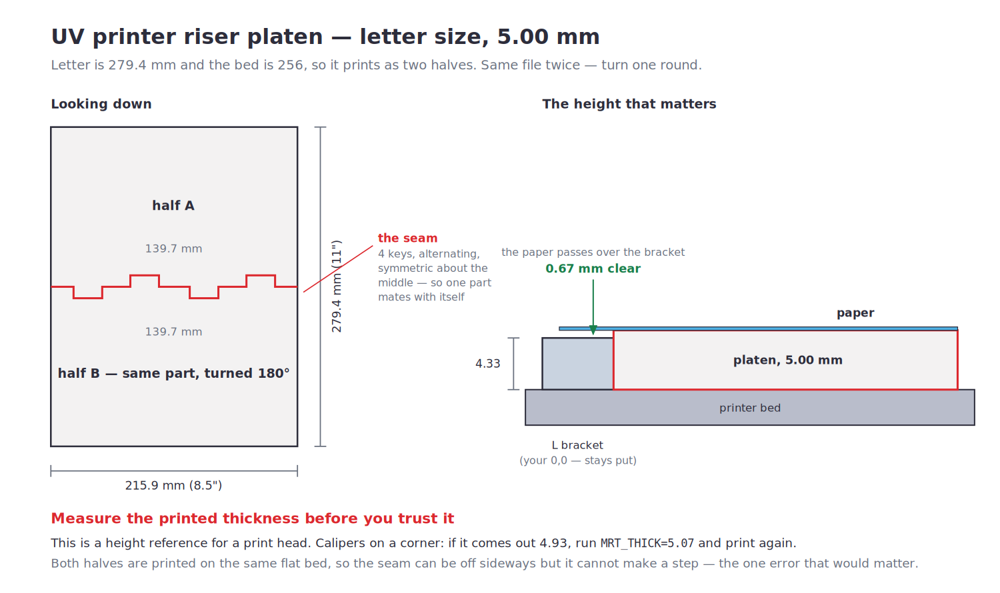

# UV Printer Riser Platen — letter size, 5.00 mm

A flat 5.00 mm slab the size of a sheet of paper. The paper sits on it, which
puts the print surface **0.67 mm clear of the 4.33 mm L bracket** — so the
bracket stays exactly where it is and your 0,0 calibration survives.



| | |
| --- | --- |
| File | `stl/uv-platen-half.stl` — **print it twice** |
| Assembled | 215.9 × 279.4 mm (8.5 × 11") × 5.00 mm |
| Each half | 215.9 × 139.7 mm, ~150 cm³ solid |
| Clearance over the bracket | 0.67 mm |

## It has to be two halves

Letter is **279.4 mm** and the P2S bed is **256**. There is no orientation that
fits it whole — rotating a 216 × 279 rectangle inside a 256 square doesn't work
at any angle.

So it splits down the middle into two 139.7 mm halves that key together at the
seam with four tongue-and-socket pairs. The pattern is **symmetric about the
middle and alternates**, so a part mates with a copy of itself turned 180° —
one file, printed twice, no left-hand and right-hand versions to mix up.

**The seam can't make a step.** Both halves are printed flat on the same bed, so
their top faces are coplanar by construction. A seam can be off sideways by the
0.15 mm fit clearance, which does nothing to a sheet of paper lying across it.
A *step* would matter, and there isn't a way to get one.

Tape the underside if you want them to stay married.

## Measure it before you trust it

This is a height reference for a print head, so the printed thickness is the
whole point and printers are not perfectly honest about Z.

**Put calipers on a corner.** If it comes out 4.93, run it again as:

```sh
MRT_THICK=5.07 python3 src/platen.py
```

The build asserts the modelled slab is exactly the thickness asked for, and that
the two halves add up to 215.9 × 279.4 — but it can't measure your printer.

## Printing

Flat, as exported. **No supports.** Use a **brim** — a 216 × 140 × 5 mm slab is
the classic corner-lifting shape, and a lifted corner here is a height error
exactly where you don't want one.

0.2 mm layers, 4 walls, 15 % infill, **5 top layers** — the top needs enough
solid skin to be genuinely flat over the infill, since that's the surface the
paper lies on.

PLA+ is right. No heat, no load, and it's the stiffest and most dimensionally
honest thing you have.

The bottom edges carry a 0.4 mm chamfer so first-layer squish-out can't make it
rock.

## If it needs to clear the bracket in plan

Right now it's a plain rectangle, on the assumption the platen registers
*against* the bracket the way your media used to — the bracket is 4.33 mm and
the platen is 5.00, so the paper simply passes over it.

If instead the platen has to sit **on top of** the bracket's footprint, it needs
a notch. Give me the bracket's footprint and which corner it's in and that's a
one-line cut.

## Rebuilding

```sh
pip install cadquery
python3 src/platen.py
```

Also writes `stl/uv-platen-assembled.stl` — both halves mated, for checking the
fit in a viewer. Don't print that one.
